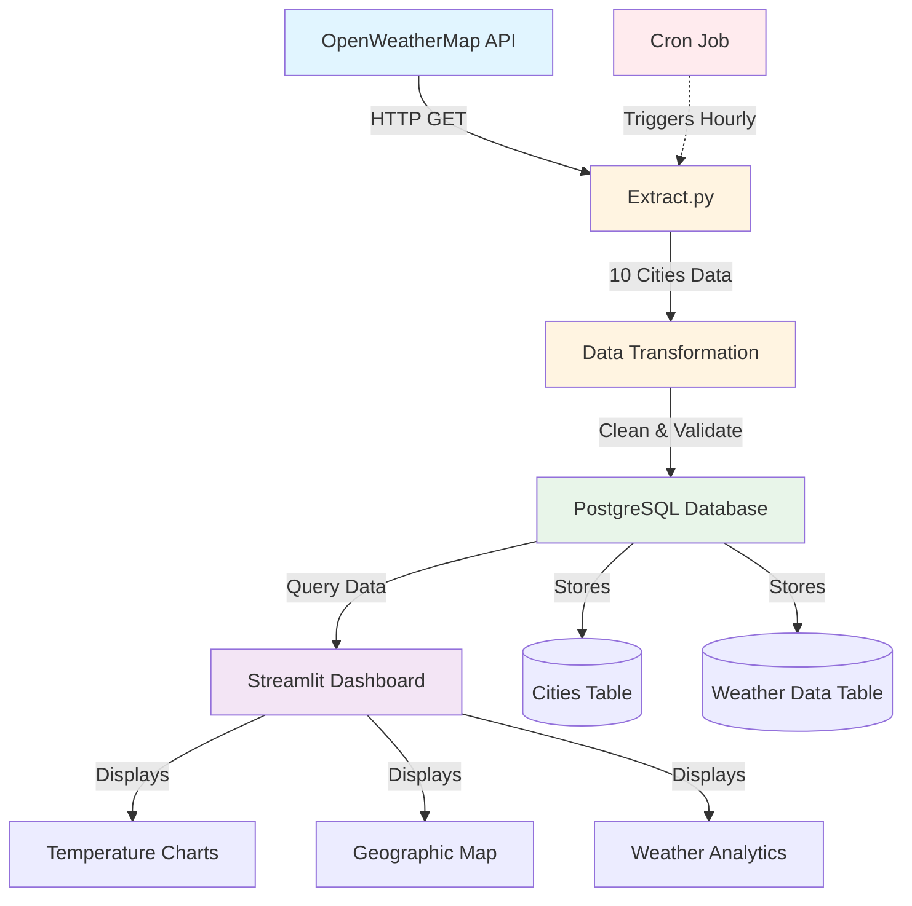

# System Architecture

## Data Flow Diagram


## Components

### 1. Data Extraction Layer
- **OpenWeatherMap API**: External data source
- **Extract.py**: Python script with retry logic and error handling
- **Cron Job**: Automated scheduling (runs every hour)

### 2. Data Processing Layer
- **Transformation**: Convert units, clean data, validate ranges
- **Validation**: Check for nulls, duplicates, and data quality

### 3. Data Storage Layer
- **PostgreSQL Database**: Relational database with star schema
  - **Cities Table** (Dimension): City metadata and coordinates
  - **Weather Data Table** (Fact): Time-series weather measurements

### 4. Presentation Layer
- **Streamlit Dashboard**: Interactive web application
- **Plotly Charts**: Dynamic visualizations
- **Cloud Hosted**: Deployed on Streamlit Cloud

## Technology Stack

| Layer | Technology |
|-------|-----------|
| Data Source | OpenWeatherMap API |
| ETL Pipeline | Python, Pandas, Requests |
| Database | PostgreSQL, SQLAlchemy |
| Automation | Cron, Bash Scripts |
| Visualization | Streamlit, Plotly |
| Deployment | Streamlit Cloud, Railway |
| Version Control | Git, GitHub |

## Data Schema

### Cities (Dimension Table)
```sql
CREATE TABLE cities (
    city_id SERIAL PRIMARY KEY,
    city_name VARCHAR(100) UNIQUE NOT NULL,
    country VARCHAR(10),
    latitude FLOAT,
    longitude FLOAT
);
```

### Weather Data (Fact Table)
```sql
CREATE TABLE weather_data (
    id SERIAL PRIMARY KEY,
    city_id INTEGER REFERENCES cities(city_id),
    timestamp TIMESTAMP NOT NULL,
    temperature FLOAT,
    feels_like FLOAT,
    temp_min FLOAT,
    temp_max FLOAT,
    humidity FLOAT,
    pressure FLOAT,
    weather_main VARCHAR(50),
    weather_description VARCHAR(100),
    wind_speed FLOAT,
    wind_direction FLOAT,
    cloudiness FLOAT,
    visibility INTEGER
);
```
